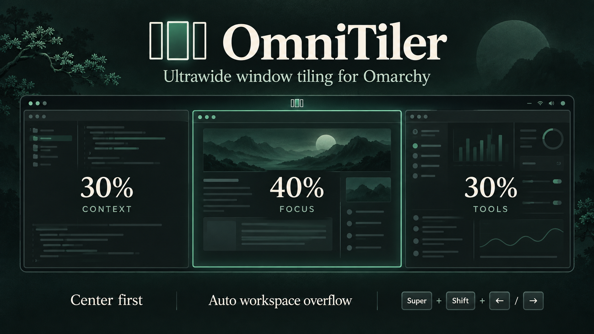

# OmniTiler — Ultrawide Window Tiler for Omarchy

Give your main window the center stage. OmniTiler brings fixed **30 / 40 / 30**
three-column window tiling to ultrawide Omarchy desktops, with automatic
workspace overflow and a toggle beside your clock.



Promotional illustration. See the [actual desktop screenshot](docs/preview.png)
and [light-theme screenshot](docs/preview-light.png) for the running plugin.

## How it works

Click the three-column bar icon on a numbered workspace. Your focused window
takes the **40% center**; the next two windows take the **30% left** and **30%
right**, in that order. Existing windows use recent-focus order. Empty columns
stay empty, and closing a window leaves its neighbors in place.

The fourth window goes to the **next empty numbered workspace on the same
monitor**, and focus follows it. That workspace continues the center → left →
right pattern. Other workspaces and monitors keep their normal behavior.
Returning to a full managed workspace and opening another window creates a
new empty overflow workspace; it does not search partially filled workspaces.

Click again to restore normal Hyprland tiling on the windows' current
workspaces. The bar icon stays installed, but tiling starts **off** after login
or a shell/plugin reload.

The icon and tooltip follow your Omarchy theme. Windows keep their usual
borders, colors, rounding, and animations. Ratios apply to usable window
width after subtracting borders, configured gaps, and reserved panel space.

## Requirements

- Omarchy 4 with the Quickshell-based Omarchy shell (tested on 4.0.4).
- Hyprland with Lua dispatch and stable window IDs (tested on 0.56.2).
- Python 3.10+; only its standard library is used.
- The built-in Omarchy bar, which supplies the plugin's service access.

This is an **Omarchy shell plugin**, not a compiled Hyprland extension. It
does not edit Hyprland configuration or require root access.

## Install

Install from [TheBoxer71/OmniTiler](https://github.com/TheBoxer71/OmniTiler):

```sh
omarchy plugin add https://github.com/TheBoxer71/OmniTiler --enable
omarchy plugin enable theboxer71.omnitiler --section center --after omarchy.clock
```

The second command places the icon immediately beside the centered clock.
Enabling the plugin loads its toggle; window tiling starts off until clicked.
For a Git-managed installation, update or remove with:

```sh
omarchy plugin update theboxer71.omnitiler
omarchy plugin remove theboxer71.omnitiler
```

### Local development installation

Clone the repository, then run the installer:

```sh
git clone https://github.com/TheBoxer71/OmniTiler.git
cd OmniTiler
python3 manage.py install
```

This validates and copies the plugin into
`~/.config/omarchy/plugins/theboxer71.omnitiler/`, then enables its bar widget
immediately after the clock. It backs up `shell.json` under
`~/.local/state/omnitiler/backups/` and leaves the centered clock anchor intact.
Run the same command to update a local installation.

Use either the Git-managed installation or the local development installer;
the latter installs a copy and is updated by rerunning `manage.py install`.

### Upgrading from 0.1.1 or earlier

Version 0.1.2 changes the plugin ID from `fredrick.omnitiler` to
`theboxer71.omnitiler`. Remove the previous ID before installing the new one;
an in-place plugin update cannot migrate its registration and directory.

```sh
omarchy-shell omnitiler deactivate
omarchy plugin remove fredrick.omnitiler
omarchy plugin add https://github.com/TheBoxer71/OmniTiler --enable
omarchy plugin enable theboxer71.omnitiler --section center --after omarchy.clock
```

For a local development installation, remove the old ID as above, then run
`python3 manage.py install` from the updated checkout instead of `plugin add`.
The IPC target remains `omnitiler`, and the author remains Fredrick Thorsen.

## Controls and IPC

- **Left click:** toggle this workspace and its overflow set.
- **Hover:** see managed workspaces, occupied slots, and any error.
- One activation set runs at a time. Switch off before activating elsewhere.

### Omarchy keyboard shortcuts

| Shortcut | Behavior |
| --- | --- |
| **Super+Shift+Left / Right** | Move the focused window one column left/right; swap windows if occupied. |
| **Super+Left / Right** | Focus a neighboring window using Omarchy's normal navigation. |
| **Super+Shift+1…0** | Move a window to the chosen workspace. |
| **Super+Shift+Alt+1…0** | Move a window to a workspace without following it. |

Moving between columns also adjusts the window to that column's width. Empty
columns accept moves, and outer edges do not wrap. Because this is a single
row, there are no above/below columns; the Up/Down bindings are unchanged.
Moving an ordinary window into a managed workspace adopts an available slot;
moving it out returns it to normal tiling. Silent moves remain silent.

While active, OmniTiler temporarily replaces the two standard Omarchy
**Super+Shift+Left/Right** swap bindings with conditional handlers. Unmanaged
windows retain native swap behavior. Turning off or unloading the plugin
restores the standard bindings; a Hyprland reload reinstalls active handlers.
No Hyprland configuration files are edited. If either shortcut has a custom
description or nonstandard flags, activation reports the conflict instead of
overwriting it.

```sh
omarchy-shell omnitiler activate
omarchy-shell omnitiler deactivate
omarchy-shell omnitiler toggle
omarchy-shell omnitiler status
```

Commands acknowledge asynchronously. `status` returns JSON with `active`,
`monitor`, `workspaces`, `occupancy`, and `error`.

## Window handling

- Each ordinary toplevel window occupies a slot, including multiple windows
  from the same application.
- Already-floating windows, floating dialogs, hidden windows, pinned windows,
  window groups, and special workspaces are excluded. Ordinary non-floating
  windows are temporarily floated for exact positioning.
- Fullscreen is respected; exiting it returns a managed window to its slot.
- Moving a managed window to an unmanaged workspace releases it to normal
  tiling. Moving it into a vacant managed workspace adopts a vacant slot.
- Windows that repeatedly reject the requested geometry are released with an
  error in the tooltip. A minimum-size-constrained application may not fit a
  side column. Dragging/resizing managed windows is reconciled back to their
  assigned slots; turn OmniTiler off for free placement.
- Monitor scale, position, rotation, reserved space, and configured general
  gaps are included. Per-workspace gap overrides are not supported in v0.1.
- Disconnecting the managed monitor releases its windows. Changing the
  active monitor alone does not expand the managed set.

## Lifecycle and recovery

The service owns one helper process, serialized by a session-local lock. The
helper journals only identities and slot assignments under
`$XDG_RUNTIME_DIR/omnitiler-*/`; no titles or application content are stored.
Before recovering a window it checks the compositor session, window address,
stable ID, and process ID. A small independent recovery watcher restores tiling
even when Quickshell forcibly terminates the helper during unload. The next
helper start also restores any remaining journal before accepting activation.
This runtime data does not carry over to a new login.

Removing the plugin's bar entry disables its service. To remove a local copy:

```sh
python3 manage.py remove
```

The removal script first restores managed windows, then removes only
OmniTiler's registration and directory. It does not restore an entire old
shell configuration over newer settings.

## Development

```sh
python3 -m unittest discover -s tests -v
omarchy plugin validate .
qmllint -I /usr/share/omarchy/shell Service.qml BarWidget.qml
```

`engine.py` separates the geometry/allocation controller from the compositor
adapter. The QML service communicates with the helper using newline-delimited
JSON on stdin/stdout. Standard input EOF or SIGTERM requests cleanup. The
helper listens to Hyprland's event socket and reconciles once per second while
active, including recovery from missed events. It performs no network calls.

Opt-in live desktop checks (temporarily open and close demonstration windows):

```sh
python3 tests/live_smoke.py --run
python3 tests/live_lifecycle.py --run
python3 tests/live_hotkeys.py --run
```

The lifecycle check also temporarily switches themes, tests helper recovery,
and removes/reinstalls the local plugin. It restores the original theme,
background, workspace, and focus when finished. See the
[light-theme preview](docs/preview-light.png) for the empty-side-column state.
The keyboard check uses a disposable virtual input device and requires
existing write access to `/dev/uinput`; it does not change device permissions.

See [marketplace material](docs/MARKETPLACE.md), [verification](docs/VERIFICATION.md),
and [changelog](CHANGELOG.md). Licensed under MIT.
